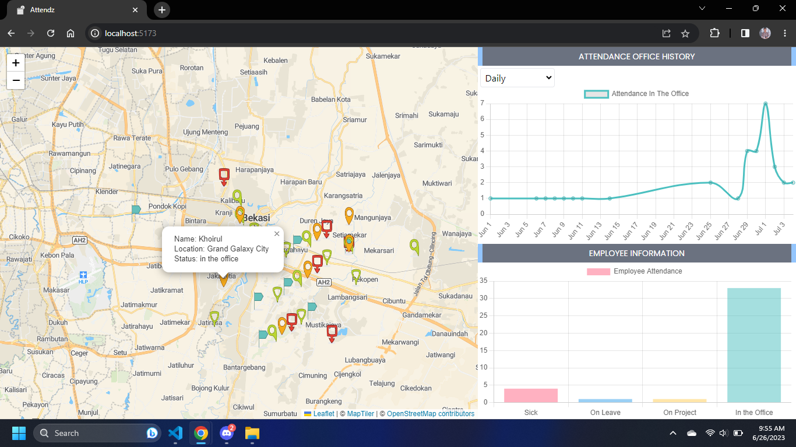

# Office Attendance Application


This web application built with React.js, using the React-Leaflet for building interactive maps, Maptiler for map visualization, Chartjs for visualizing diagrams and graph data, TailwindCSS for styling, and JSON Server for dummy server.

## Installation

To install the dependencies, run the following command:

```
npm install
```

## Running the Dummy Server

To run the JSON Server as a dummy server, use the following command:

```
npx json-server --watch db.json
```

This will start the dummy server and serve the data from the `db.json` file.

## Running the Application

To run the application, use the following command:

```
npm run dev
```

This will start the development server and launch the application in your default web browser.

## Screenshots


_The dashboard displays attendance statistics and a map with employee markers._

## Contact

For any inquiries or suggestions, please contact:

- Khoirul Ariffin
- Email: khoirulariffin@gmail.com

Feel free to include additional sections or modify the provided template to suit your project's specific needs.
